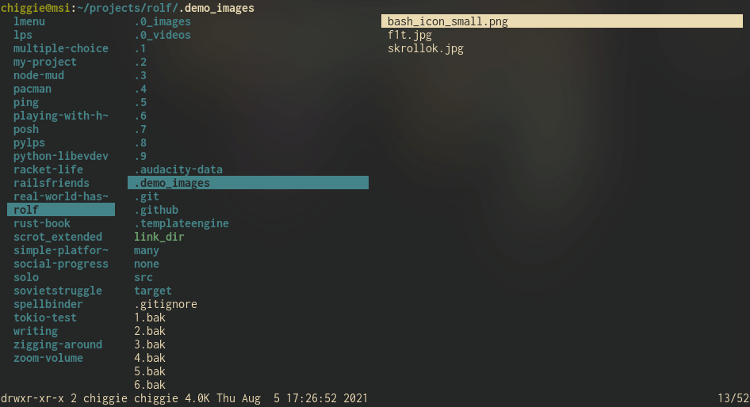

# Rolf

> This is _definitely_ a work in progress. Use at your own risk.

`rolf` is a terminal file manager written in Rust. It is mostly inspired by
`lf`, but it is far worse.

## Documentation
Unfortunately, there's no documentation.

Once `rolf` is in a more usable state, I'll actually add something useful.

## TODOs
- [x] Render three panels
- [x] Support super-basic hjkl movement
- [ ] Allow key rebindings
- [x] Use [highlight](http://www.andre-simon.de/doku/highlight/highlight.php)
      for text file highlighting
- [ ] Make [highlight](http://www.andre-simon.de/doku/highlight/highlight.php)
      an optional dependency.
- [ ] Implement command-line
- [x] EXPERIMENTAL: Display image previews on kitty
  - [ ] Fix broken parts of image previews
- [ ] Make symlinks actually usable
- [x] Fix compiler warnings on latest version of Rust stable

# Long-term TODO (May Never Happen)
- [ ] Add Windows support
- [ ] Implement our own png and jpeg decoders
- [ ] Use the kitty protocol (and possibly other terminal image protocols)
      directly for image previews
